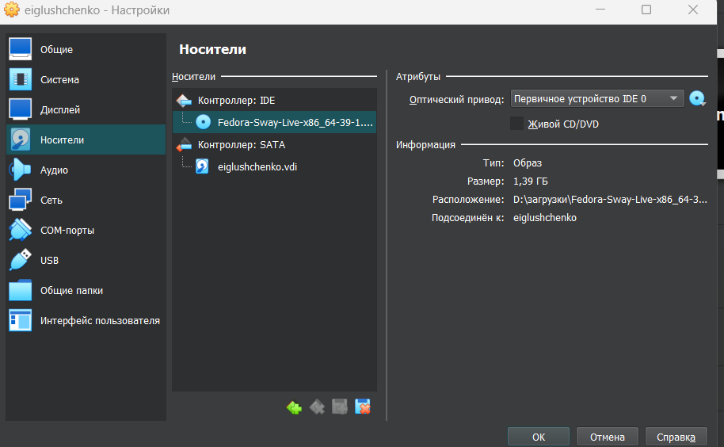

---
## Front matter
title: "Отчет по лабораторной работе №1"
subtitle: "Операционные системы"
author: "Глущенко Евгений Игоревич"

## Generic otions
lang: ru-RU
toc-title: "Содержание"

## Bibliography
bibliography: bib/cite.bib
csl: pandoc/csl/gost-r-7-0-5-2008-numeric.csl

## Pdf output format
toc: true # Table of contents
toc-depth: 2
lof: true # List of figures
lot: true # List of tables
fontsize: 12pt
linestretch: 1.5
papersize: a4
documentclass: scrreprt
## I18n polyglossia
polyglossia-lang:
  name: russian
  options:
	- spelling=modern
	- babelshorthands=true
polyglossia-otherlangs:
  name: english
## I18n babel
babel-lang: russian
babel-otherlangs: english
## Fonts
mainfont: PT Serif
romanfont: PT Serif
sansfont: PT Sans
monofont: PT Mono
mainfontoptions: Ligatures=TeX
romanfontoptions: Ligatures=TeX
sansfontoptions: Ligatures=TeX,Scale=MatchLowercase
monofontoptions: Scale=MatchLowercase,Scale=0.9
## Biblatex
biblatex: true
biblio-style: "gost-numeric"
biblatexoptions:
  - parentracker=true
  - backend=biber
  - hyperref=auto
  - language=auto
  - autolang=other*
  - citestyle=gost-numeric
## Pandoc-crossref LaTeX customization
figureTitle: "Рис."
tableTitle: "Таблица"
listingTitle: "Листинг"
lofTitle: "Список иллюстраций"
lotTitle: "Список таблиц"
lolTitle: "Листинги"
## Misc options
indent: true
header-includes:
  - \usepackage{indentfirst}
  - \usepackage{float} # keep figures where there are in the text
  - \floatplacement{figure}{H} # keep figures where there are in the text
---

# Цель работы

Целью данной работы является приобретение практических навыков установки операционной системы на виртуальную машину, настройки минимально необходимых для дальнейшей работы сервисов.

# Задание

1. Создание виртуальной машины
2. Установка операционной системы
3. Работа с операционной системой после установки
4. Установка программного обеспечения для создания документации
5. Дополнительные задания

# Выполнение лабораторной работы

Описываются проведённые действия, в качестве иллюстрации даётся ссылка на иллюстрацию (рис. [-@fig:001]).

##Создание виртуальной машины

Открываю уже установленный VirtualBox (рис @fig:001)

{#fig:001 width=70%}

Создаю новую виртуальную машину (рис. @fig:002)

{#fig:002 width=70%}

Указываю количество оперативной памяти 4096 МБ (рис @fig:003)

{#fig:003 width=70%}

Создаю новый жесткий диск, указываю размер 80 ГБ (рис @fig:004)

{#fig:004 width=70%}

Все готово! (рис @fig:005)

{#fig:005 width=70%}

Выбираю в Virtualbox настройку своей виртуальной машины. Перехожу в “Носи тели”, добавляю новый привод привод оптических дисков и выбираю скачанный
образ операционной системы Fedora (рис @fig:006)

{#fig:006 width=70%}

Образ успешно установлен (рис @fig:007)

{#fig:007 width=70%}

##Установка операционной системы

Запускаю систему (рис @fig:008)

{#fig:008 width=70%}

Устанавливаем Fedora (рис @fig:009)

{#fig:009 width=70%}

Указываем свои данные(рис @fig:011)

{#fig:011 width=70%}

Все получилось (рис @fig:010)

{#fig:010 width=70%}

## Работа с операционной системой

Захожу в терминал и переключаюсь  роль супер пользователя, обновляю все пакеты (рис @fig:012)

{#fig:012 width=70%}

Устанавливаю tmux для удобства дальнейшей работы (рис @fig:014)

{#fig:014 width=70%}

Устанавливаю автоматическое обновление програм через таймер. (рис @fig:016)

{#fig:016 width=70%}

Перемещаюсь в дерикторию указанную в лабораторной работе, ищу нужный мне файл (рис @fig:017)

{#fig:017 width=70%}

Изменяю значение на нужное мне (рис @fig:018)

{#fig:018 width=70%}

После перезагружаю ВМ, запускаю терминал мультиспектра, переключаюсь на супер пользователя (рис @fig:019)

{#fig:019 width=70%}

Устанавливаю пакет (рис @fig:020 )

{#fig:020 width=70%}

Опять перезагружаю ВМ, после чего в терминале прописываю tmux (рис @fig:022 )

{#fig:022 width=70%}

Перехожу в указанную дерикторию и открываю mc для удобства (рис @ig:024)

{#fig:024 width=70%}

Редактирую файл (рис @fig:026)

{#fig:026 width=70%}

## Установка програмного обеспечения для работы с документацией

Запускаю терминал, запускаю tmux и переключаюсь на роль супер пользователя (рис @fig:027)

{#fig:027 width=70%}

Устанавливаю pandoc и texlive

# Выводы

При выполнении данной лабораторной работы я приобрел практические
навыки установки операционной системы на виртуальную машину, а так же
сделал настройки минимально необходимых для дальнейшей работы сервисов.

# Список литературы{.unnumbered}

1. Dash P. Getting started with oracle vm virtualbox. Packt Publishing Ltd, 2013. 86
p.
2. Colvin H. Virtualbox: An ultimate guide book on virtualization with virtualbox.
CreateSpace Independent Publishing Platform, 2015. 70 p.
3. van Vugt S. Red hat rhcsa/rhce 7 cert guide : Red hat enterprise linux 7 (ex200
and ex300). Pearson IT Certification, 2016. 1008 p.
4. Робачевский А., Немнюгин С., Стесик О. Операционная система unix. 2-е
изд. Санкт-Петербург: БХВ-Петербург, 2010. 656 p.
5. Немет Э. et al. Unix и Linux: руководство системного администратора. 4-е
изд. Вильямс, 2014. 1312 p.
6. Колисниченко Д.Н. Самоучитель системного администратора Linux. СПб.:
БХВ-Петербург, 2011. 544 p.
7. Robbins A. Bash pocket reference. O’Reilly Media, 2016. 156 p.

::: {#refs}
:::
