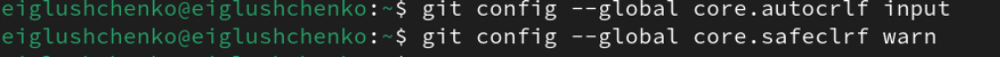

---
## Front matter
title: "Отчет по лабораторной работе №2"
subtitle: "Операционные системы"
author: "Глущенко Евгений Игоревич"

## Generic otions
lang: ru-RU
toc-title: "Содержание"

## Bibliography
bibliography: bib/cite.bib
csl: pandoc/csl/gost-r-7-0-5-2008-numeric.csl

## Pdf output format
toc: true # Table of contents
toc-depth: 2
lof: true # List of figures
lot: true # List of tables
fontsize: 12pt
linestretch: 1.5
papersize: a4
documentclass: scrreprt
## I18n polyglossia
polyglossia-lang:
  name: russian
  options:
	- spelling=modern
	- babelshorthands=true
polyglossia-otherlangs:
  name: english
## I18n babel
babel-lang: russian
babel-otherlangs: english
## Fonts
mainfont: PT Serif
romanfont: PT Serif
sansfont: PT Sans
monofont: PT Mono
mainfontoptions: Ligatures=TeX
romanfontoptions: Ligatures=TeX
sansfontoptions: Ligatures=TeX,Scale=MatchLowercase
monofontoptions: Scale=MatchLowercase,Scale=0.9
## Biblatex
biblatex: true
biblio-style: "gost-numeric"
biblatexoptions:
  - parentracker=true
  - backend=biber
  - hyperref=auto
  - language=auto
  - autolang=other*
  - citestyle=gost-numeric
## Pandoc-crossref LaTeX customization
figureTitle: "Рис."
tableTitle: "Таблица"
listingTitle: "Листинг"
lofTitle: "Список иллюстраций"
lotTitle: "Список таблиц"
lolTitle: "Листинги"
## Misc options
indent: true
header-includes:
  - \usepackage{indentfirst}
  - \usepackage{float} # keep figures where there are in the text
  - \floatplacement{figure}{H} # keep figures where there are in the text
---

# Цель работы

Цель данной работы - изучить идеологию и применение средств контроля версий, освоить умения по работе с git.

# Задание

    Создать базовую конфигурацию для работы с git.
    Создать ключ SSH.
    Создать ключ PGP.
    Настроить подписи git.
    Зарегистрироваться на Github.
    Создать локальный каталог для выполнения заданий по предмету.

# Выполнение лабораторной работы
##Установка программного обеспечения

Устанавливаю необходимое обеспеченье через терминал (рис @fig:001)

{#fig:001 width=70%}

##Базовая настройка git

Записываю свои данные в строках (почта и имя) (рис @fig:001)

{#fig:002 width=70%}

Настраиваю utf-8 в выводе сообщений (рис @fig:003)

{#fig:003 width=70%}

Задаю имя master начальной ветке (рис @fig:004)

{#fig:004 width=70%}

Задаю параметры для коректного отображения (рис @fig:005)

{#fig:005 width=70%}

##Создайте ключи ssh

Создаю ssh ключ размером 4096 бит (рис @fig:006)

{#fig:006 width=70%}

Создаю ключ по алгоритму ed25519 (рис @fig:007)

{#fig:007 width=70%}

##Создайте ключи pgp

Генерирую ключ GPG, затем выбираю тип ключа RSA and RSA, задаю максим мальную длину ключа: 4096, оставляю неограниченный срок действия ключа.
Далее отвечаю на вопросы программы о личной информации (рис @fig:008)
 
{#fig:008 width=70%}

Создаю защитную фразу (рис @fig:009)

{#fig:009 width=70%}

##Настройка github

У меня имеется профиль в гитхабе, работаю на нем (рис @fig:010)

{#fig:0010 width=70%}

##Добавление PGP ключа в GitHub

Вывожу список созданных ключей в терминал, ищу в результате запроса отпечаток ключа он стоит после знака слеша, копирую
его в буфер обмена (рис @fig:011)

{#fig:011 width=70%}

Копирую ключ с помощью xclip (рис @fig:012)

{#fig:012 width=70%}

Вставляю ключ в GitHub (рис @fig:013)

{#fig:013 width=70%}

Ключ добавлен (рис @fig:014)

{#fig:014 width=70%}

##Настройка автоматических подписей коммитов git

Настраиваю автоматические подписи коммитов git: используя введенный
ранее email, указываю git использовать его при создании подписей коммитов (рис @fig:015)

{#fig:015 width=70%}

##Настройка gh

Настраиваю gh, отвечаю на вопросы, авторизуюсь через браузер (рис @fig:016)

{#fig:016 width=70%}

Прохожу авторизацию (рис @fig:017)

{#fig:017 width=70%}

Завершаю авторизацию в терминале (рис @fig:018)

{#fig:018 width=70%}

##Шаблон для рабочего пространства

Создаю рабочую папку, перехоху в нее, и создаю репозиторий на основе шаблона. (рис @fig:019)

{#fig:019 width=70%}

Клонирую репозиторий к себе в директорию (рис @fig:020)

{#fig:020 width=70%}

Перехожу в католог курса и проверяю его содержание. (рис @fig:021)

{#fig:021 width=70%}

Удаляю лишние файлы (рис @fig:022)

{#fig:022 width=70%}

Отправка файлов на github (рис @fig:023)

{#fig:023 width=70%}

# Выводы

При выполнении данной работы я изучил основы работы с github.

# Ответы на контрольные вопросы

1. Системы контроля версий (VCS) - программное обеспечение для облегчения
работы с изменяющейся информацией. Они позволяют хранить несколько
версий изменяющейся информации, одного и того же документа, может
предоставить доступ к более ранним версиям документа. Используется для
работы нескольких человек над проектом, позволяет посмотреть, кто и
когда внес какое-либо изменение и т. д. VCS ррименяются для: Хранения
понлой истории изменений, сохранения причин всех изменений, поиска
причин изменений и совершивших изменение, совместной работы над
проектами.
2. Хранилище – репозиторий, хранилище версий, в нем хранятся все доку менты, включая историю их изменения и прочей служебной информацией.
commit – отслеживание изменений, сохраняет разницу в изменениях. Ис тория – хранит все изменения в проекте и позволяет при необходимости
вернуться/обратиться к нужным данным. Рабочая копия – копия проекта,
основанная на версии из хранилища, чаще всего последней версии.
3. Централизованные VCS (например: CVS, TFS, AccuRev) – одно основное хра нилище всего проекта. Каждый пользователь копирует себе необходимые
ему файлы из этого репозитория, изменяет, затем добавляет изменения
обратно в хранилище. Децентрализованные VCS (например: Git, Bazaar) –
у каждого пользователя свой вариант репозитория (возможно несколько
вариантов), есть возможность добавлять и забирать изменения из любого
18
репозитория. В отличие от классических, в распределенных (децентралио ванных) системах контроля версий центральный репозиторий не является
обязательным.
4. Сначала создается и подключается удаленный репозиторий, затем по мере
изменения проекта эти изменения отправляются на сервер.
5. Участник проекта перед началом работы получает нужную ему версию
проекта в хранилище, с помощью определенных команд, после внесения
изменений пользователь размещает новую версию в хранилище. При этом
предыдущие версии не удаляются. К ним можно вернуться в любой момент.
6. Хранение информации о всех изменениях в вашем коде, обеспечение удоб ства командной работы над кодом.
7. Создание основного дерева репозитория: git init
Получение обновлений (изменений) текущего дерева из центрального репози тория: git pull
Отправка всех произведённых изменений локального дерева в центральный
репозиторий: git push
Просмотр списка изменённых файлов в текущей директории: git status
Просмотр текущих изменений: git diff
Сохранение текущих изменений: добавить все изменённые и/или созданные
файлы и/или каталоги: git add .
добавить конкретные изменённые и/или созданные файлы и/или каталоги: git
add имена_файлов
удалить файл и/или каталог из индекса репозитория (при этом файл и/или
каталог остаётся в локальной директории): git rm имена_файлов
Сохранение добавленных изменений:
сохранить все добавленные изменения и все изменённые файлы: git commit
-am ‘Описание коммита’ сохранить добавленные изменения с внесением комментария через встроен ный редактор: git commit
создание новой ветки, базирующейся на текущей: git checkout -b имя_ветки
переключение на некоторую ветку: git checkout имя_ветки (при переключении
на ветку, которой ещё нет в локальном репозитории, она будет создана и связана
с удалённой)
отправка изменений конкретной ветки в центральный репозиторий: git push
origin имя_ветки
слияние ветки с текущим деревом: git merge –no-ff имя_ветки
Удаление ветки:
удаление локальной уже слитой с основным деревом ветки: git branch -d
имя_ветки
принудительное удаление локальной ветки: git branch -D имя_ветки
удаление ветки с центрального репозитория: git push origin :имя_ветки
8. git push -all отправляем из локального репозитория все сохраненные из менения в центральный репозиторий, предварительно создав локальный
репозиторий и сделав предварительную конфигурацию.
9. Ветвление - один из параллельных участков в одном хранилище, исходящих
из одной версии, обычно есть главная ветка.Между ветками,т. е. их концами
возможно их слияние. Используются для разработки новых функций.
10. Во время работы над проектом могут создаваться файлы, которые не следу ют добавлять в репозиторий. Например, временные файлы. Можно пропи сать шаблоны игнорируемых при добавлении в репозиторий типов файлов
в файл .gitignore с помощью сервисов.

# Список литературы{.unnumbered}
 
https://esystem.rudn.ru/mod/page/view.php?id=1098790

::: {#refs}
:::
